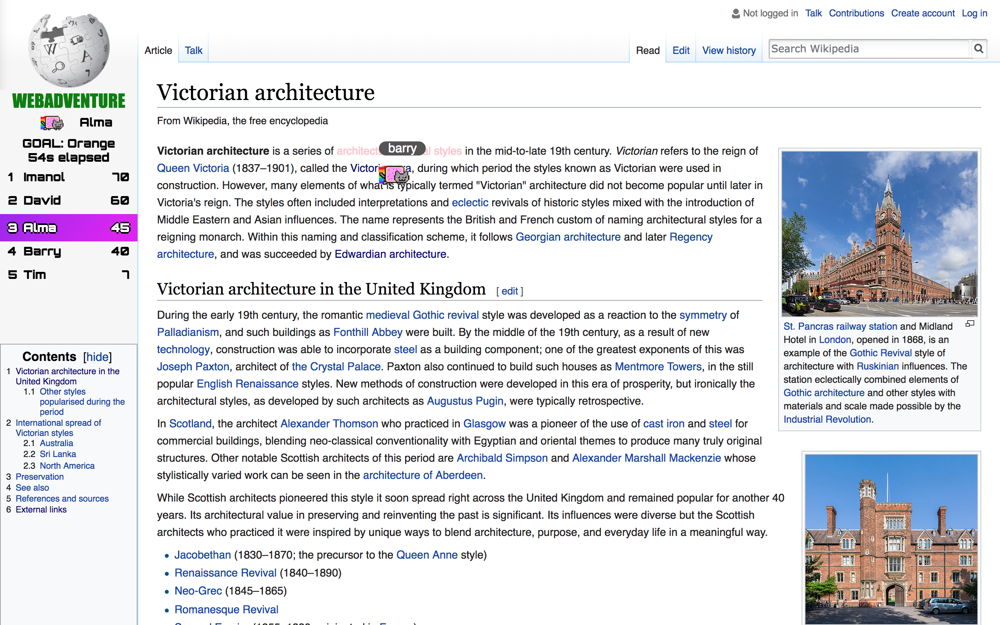
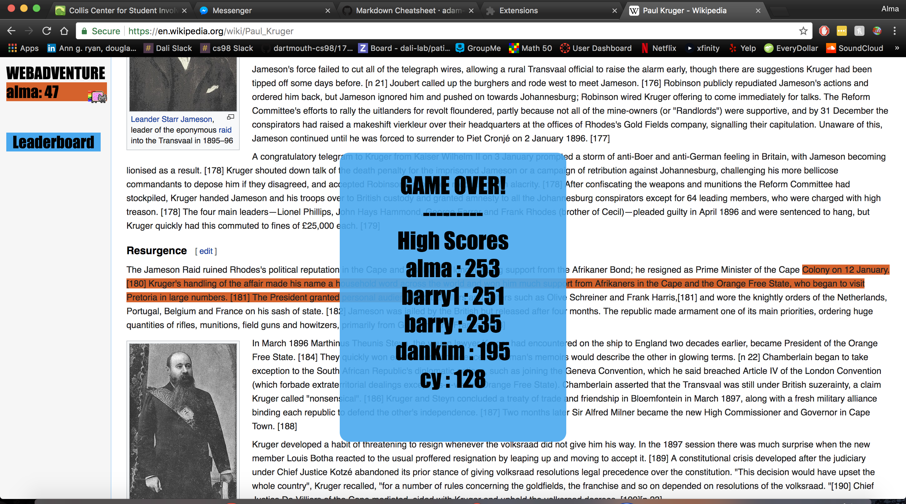

# WebAdventure

WebAdventure is a Chrome Extension that provides a unique and fun way of interacting with Wikipedia via a game format. Players interact with webpages in a multiplayer snake game that combines reading content with the competitive multiplayer snake game.

We developed the game by adapting the popular game of Snake and [paper.io](http://www.best.io/paper-io) so that it takes place on the text of a webpage (we choose Wikipedia.com for this iteration). Players fight for control of a webpage by taking up area with the limitation they cannot exceed the boundaries of the content and cannot run into any snake trail (their own or any opponents'). They  As the game runs the player's stats (score, area collected) are displayed to other users.

For mockups of the page, please visit https://github.com/dartmouth-cs98/17f-webadventure/wiki and click on the link titled "Link to Figma"

Example of Game:




## Architecture

Our Chrome Extension currently injects Javascript into a Wikipedia page and using JQuery to parse and modify the page. The extension code is compiled and built using Babel and Webpack.

On the backend we are using MongoDB and Mongoose to access the data. Visit https://github.com/dartmouth-cs98/webadventure-backend for the backend repo.

The frontend and backend communicate via web sockets (using Socket.io).

## Setup

We are using vanilla Javascript, JQuery, HTML and CSS right now to inject the game onto the Wikipedia page.

After pulling the repo run:
```
npm install
npm run build
```

Then load the unpacked extension onto the [Chrome Extensions](chrome:\\extensions) settings page.

Run the game by clicking on the extension icon and the game will provide instructions.

By default the game uses the deployed backend. To use a locally deployed backend change the socketserver variable in gameData.js

## Deployment

At this stage, we plan to deploy via Chrome extension using Google Developer Tools (chrome://extensions).

Before reloading as an extension, run the command:
```
npm install
npm run build
```
Then add the unpacked extension to Chrome.

Click on the extension.

Have fun!

## Gameplay
To move the snake make sure the Wikipedia page in focus (click on it if it's not) and move using the keys 'W', 'A', 'S', 'D'.

The edges of the game are the top and bottom of any given section. Avoid going into an edge and the snake's trail.

## Snake Colors Supported
Blue jeans: 91, 192, 235
Gargoyle Gas: 253, 231, 76
Android Green: 155, 197, 61
Flame: 229, 89, 52
Princeton Orange: 250, 121, 33
(Found on [coolors.co](https://coolors.co/5bc0eb-fde74c-9bc53d-e55934-fa7921))

## Summary of Term 1

### November 14 Demo Feedback

Please see Google Doc to directly view responses submitted from November 14 Demo:
https://docs.google.com/spreadsheets/d/1WIavWqiqqkvedVlsRr5hxJsht_0UQjWsiwfunbVE8TY/edit?usp=sharing

### What worked and didn't work

The game went through an evolution this term in terms of ideas, but eventually we got the concept down to an innovative way to browse a Wikipedia webpage. By the end of the term, we definitely reached a great minimum viable product. The game navigates smoothly with a single player and all critical functions work well in singleplayer mode, such as navigation through a page and interaction with backend.

We had a lot of ideas for features during this term, include question modules, obstacles, hyperlink navigation, but we developed a good scaffold that we can expand upon this term. We noticed that the game wasn't very fun to a lot of users at the demo when they were playing by themselves, but we also noticed that users really enjoyed the multiplayer aspect (when someone played against someone else at the demo). Unfortunately, the game is fairly buggy when there are a great deal of users at the same time. This is an issue we hope to resolve in the future.

The game also needs to be more intuitive to players. That was another big flaw we recognized during the pre-demo bug hunt, and attempted to fix. Some users still didn't feel like the game was intuitive, despite adding a rules section prior to running the game.

### User testing plan

We hope to deploy the chrome extension early next term and solicit feedback from users who directly use the Chrome extension. This would be after critical fixes are implemented. We will also use time early next term to read over the feedback from the demo and implement relevant changes as well.

### Summary and Next Term Ideas

We created a great minimum viable produt this term and will expand upon that for next term. We are not too worried about playability as we realized this game really shined during multiplayer aspects. Next term, we hope to clean up the bugs we noticed from the demo and implement features that we listed as issues in this repository.

Because we reached the MVP, next term will be focused on fixing bugs, adding features, bolstering user experience. Some ideas include:

- Question module
- Nice animations (upon death and rendering of other players)
- Smoothing multiplayer functionality
- Clarifying instructions and incorporating HCD elements into the game
- Graceful exit (and proper updating to the server upon unexpected exit)
- Website with statistics of the game, a link to download the chrome extension (home page website)

## Authors

* Imanol "Idea Guy" Avendaño
* Stephanie "Load Balancer" Guo
* David "Dreamer/Doh" Oh
* Alma "Savage" Wang
* Barry "PM" Yang

## Acknowledgments
Tim for being our shepherd and guiding light.
