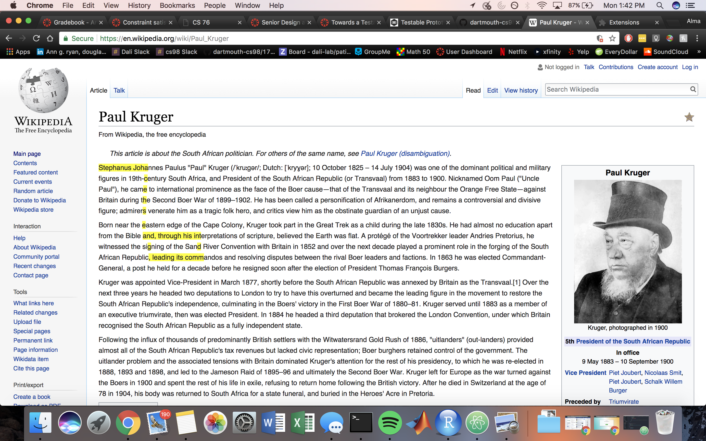

# WebAdventure

We plan to develop an extensible program for overlaying and interacting with Wikipedia via a game format. “Players” will interact with webpages in a novel way that could be used by clients for data collection.

We intend to adapt the game paper.io that interacts with a webpage (we choose Wikipedia.com for this iteration). Players would fight for "control" of a webpage via taking up area, like in paper.io. We plan to control the environment by limiting the number of hyperlinks and setting a low-depth, such that a limited number of pages within a tree can be explored. After the game ends, the user's name and score would be recorded.

For mockups of the page, please visit https://github.com/dartmouth-cs98/17f-webadventure/wiki and click on the link titled "Link to Figma"

Example of Game:


## Architecture

We are using a chrome extension to inject javascript into a Wikipedia page or a pre-defined webpage. The extension code is compiled and built using Babel and Webpack.

On the backend we are using MongoDB and Mongoose to access the data. Visit https://github.com/dartmouth-cs98/webadventure-backend for the backend repo.

The frontend and backend communicate via web sockets (using Socket.io).

## Setup

We are using vanilla Javascript and jquery right now to test javascript injection. We are considering options such as Node.js to build the game. This section will evolve as the game developers.

## Deployment

At this stage, we plan to deploy via Chrome extension using Google Developer Tools (chrome://extensions).

We've added in Babel to compile JS. Before reloading as an extension, run the command:
```
npm run build
```
Then add the unpacked extension to Chrome

Run mongod and the [backend](https://github.com/dartmouth-cs98/webadventure-backend)
Go on [localhost:9090](localhost:9090) (currently we load a mock wikipedia page for dev purposes) and click on the extension

Have fun!

## Gameplay
To move the snake make sure the Wikipedia page in focus (click on it if it's not) and move using the keys 'W', 'A', 'S', 'D'.

The edges of the game are the top and bottom of any given section. Avoid going into an edge and the snake's trail.

## Authors

* Imanol "Idea Guy" Avendaño
* Stephanie "Load Balancer" Guo
* David "Dreamer/Doh" Oh
* Alma "Savage" Wang
* Barry "PM" Yang

## Acknowledgments
Tim for being our shepherd and guiding light.
